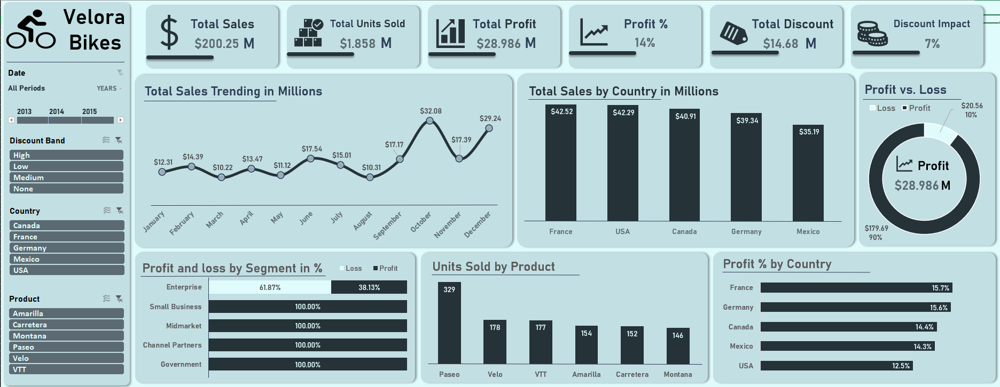

# Sales Dashboard Project

 I developed an interactive Sales & Profit Dashboard using Excel and Power Query to analyze business performance and provide data-driven insights that support better decision-making.
- Data Preparation:
The dataset was cleaned and transformed using Power Query, ensuring data consistency, accuracy, and readiness for analysis.
- Key Performance Indicators (KPIs):
I built a set of important KPIs to reflect overall business performance:
-- Total Sales
-- Total Units Sold
-- Total Profit
-- Total Discount
-- Discount Impact on Sales

- Data Visualization & Analysis:
The dashboard includes multiple interactive charts to explore trends and performance from different perspectives:
-- Sales trend over time
-- Total Sales by Country
-- Profit vs Loss analysis
-- Profit by Country
-- Units Sold by Product
-- Profit & Loss distribution by Segment (%)

- Interactive Filters (Slicers):
To enable dynamic exploration of the data, I implemented:
-- Timeline (Date-based filtering)
-- Discount Band
-- Country
-- Product

- Project Objective:
The goal of this dashboard is to provide clear visibility into sales performance, profitability, and discount impact, helping identify key insights such as:
Best-performing countries and products
The relationship between discounts and profitability
Overall business performance trends over time
This project helped me strengthen my skills in data cleaning, analysis, visualization, and building interactive dashboards for business intelligence purposes 🚀
